# Recommendation System for Movie Recommendation
## Introduction
This project introduces a hybrid recommendation system that combines collaborative filtering with content-based techniques. Using item features and an open-source LLM, dense semantic embeddings from metadata (descriptions, categories, tags) enhance recommendations. Integrating these embeddings with user-item interactions boosts personalization, especially for cold-start items or those with limited history. This approach leverages new infrastructure and tools for better recommendations.

## Data Visualisation
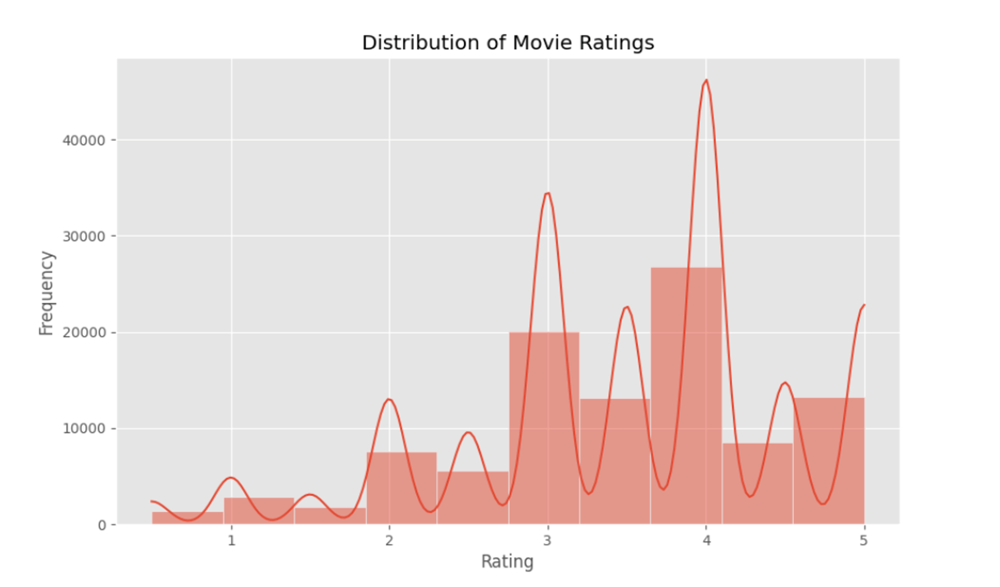
Figure 1: Distribution of Move Ratings: The chart illustrates the distribution of movie ratings, with the x-axis representing rating values (typically ranging from 1 to 5) and the y-axis indicating their frequency. The ratings exhibit an approximately normal distribution, characterized by a higher concentration of mid-range scores and fewer occurrences of extreme ratings at both ends of the scale.

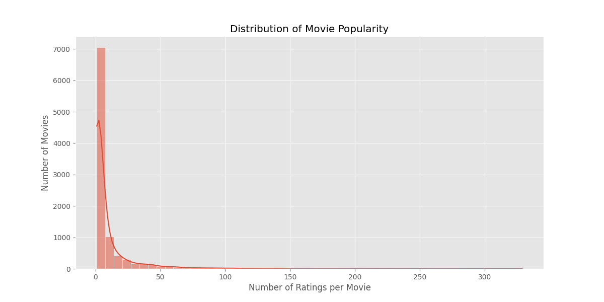
Figure 2: This chart illustrates the distribution of movie popularity. The horizontal axis represents the number of ratings each movie has received, while the vertical axis indicates the number of movies with the same rating count. The data shows that most movies receive relatively few ratings, while only a small number of films accumulate a large number of ratings. This distribution typically follows a long-tail pattern, suggesting that a few blockbuster films capture the majority of audience attention, while most movies remain relatively less popular.

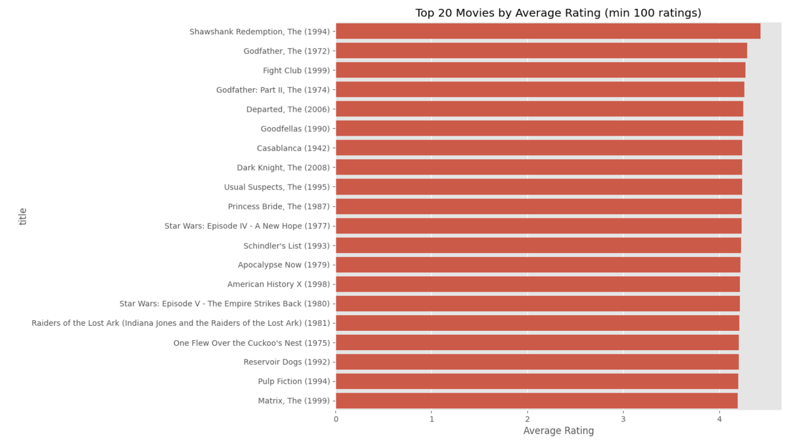
Figure 3: This chart presents the top 20 movies with the highest average ratings (with at least 100 ratings). The horizontal axis represents the average rating, while the vertical axis displays the movie titles. The chart provides insights into which movies are rated most highly by audiences.

## Item-Based CF Results
Develop a model that utilizes similarity scores to predict the likelihood of a user liking an item, based on their previous interactions with similar items.

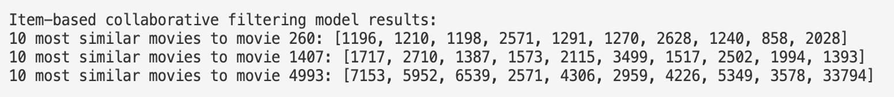

The top ten movies corresponding to 260, 1407, and 4993 are listed. The following three charts provide visualizations, which can be analyzed in detail during the presentation.

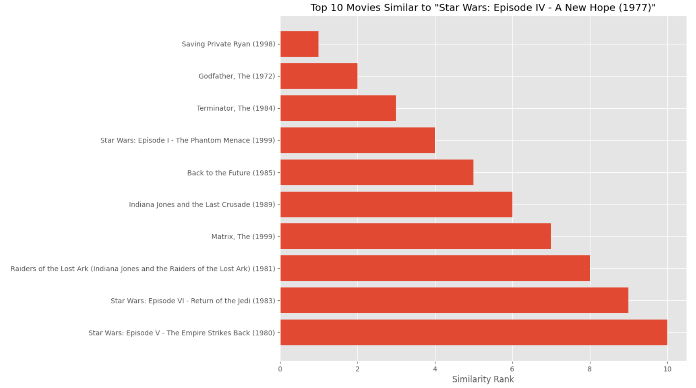
Figure 4: The movie with ID 260 is Star Wars: Episode IV – A New Hope (1977).

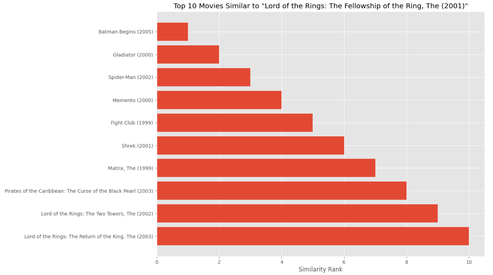
Figure 5: The movie with ID 4993 is Lord of Rings

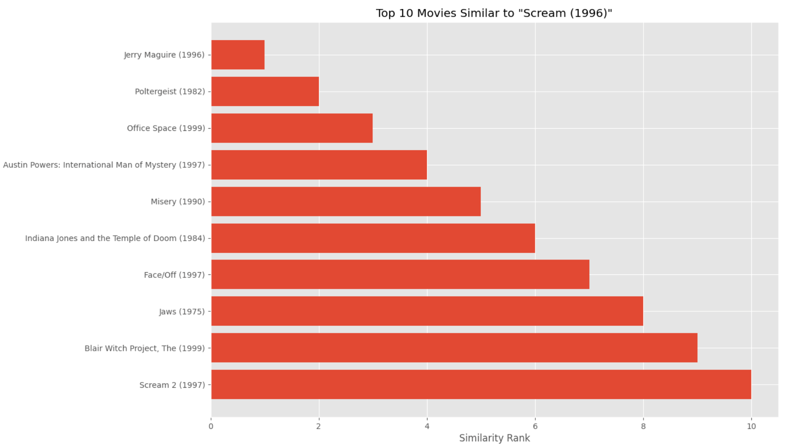
Figure 6": The movie with ID 1407 is Scream 1996

## MF Results
The user-item rating matrix was decomposed into lower-dimensional user and item factors to predict missing ratings and generate recommendations.

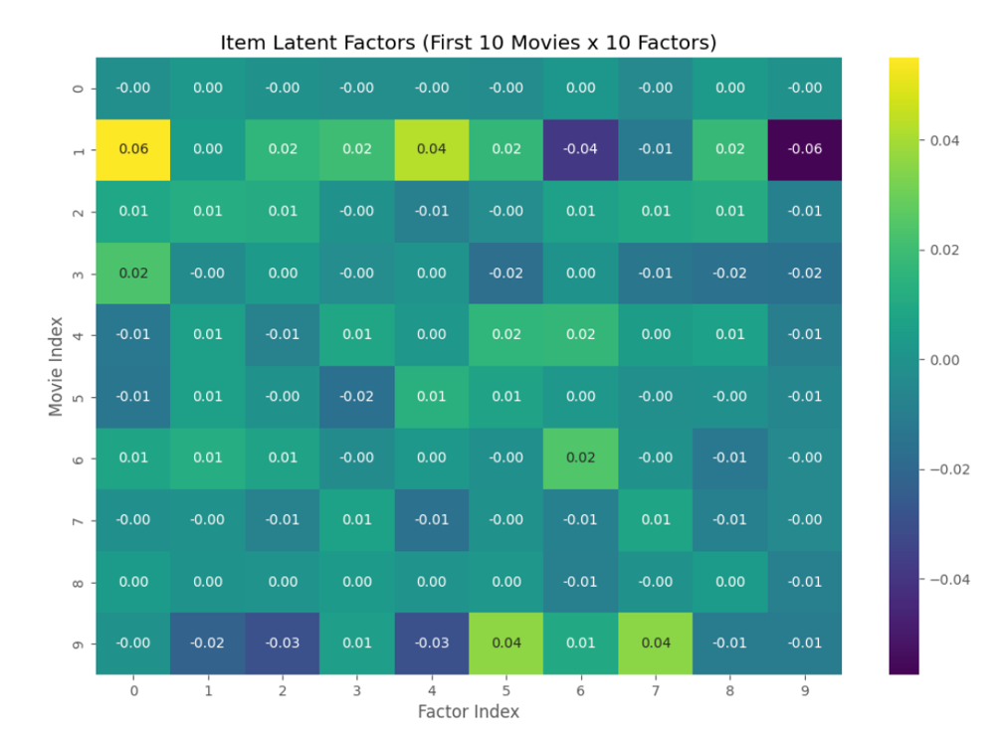
Figure 7: Item Iatent Factors

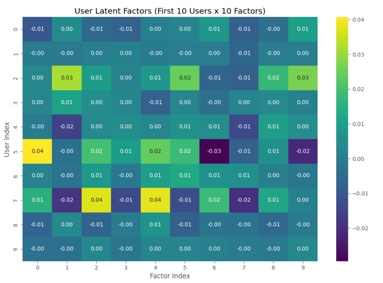
Figure 8: User Latent Factors

These are the actual rating records for the three users.
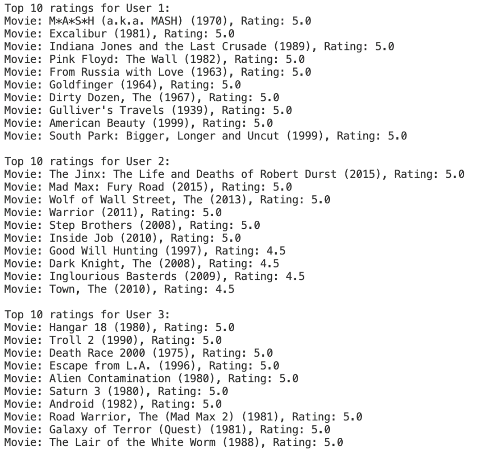

The recommendation in details:

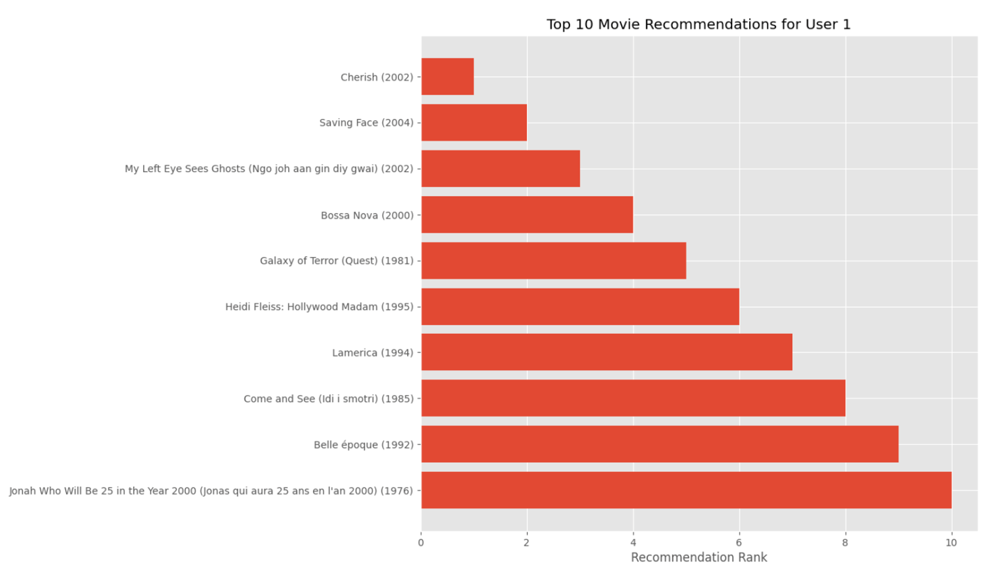
Figure 9: Movie recommendations for User 1

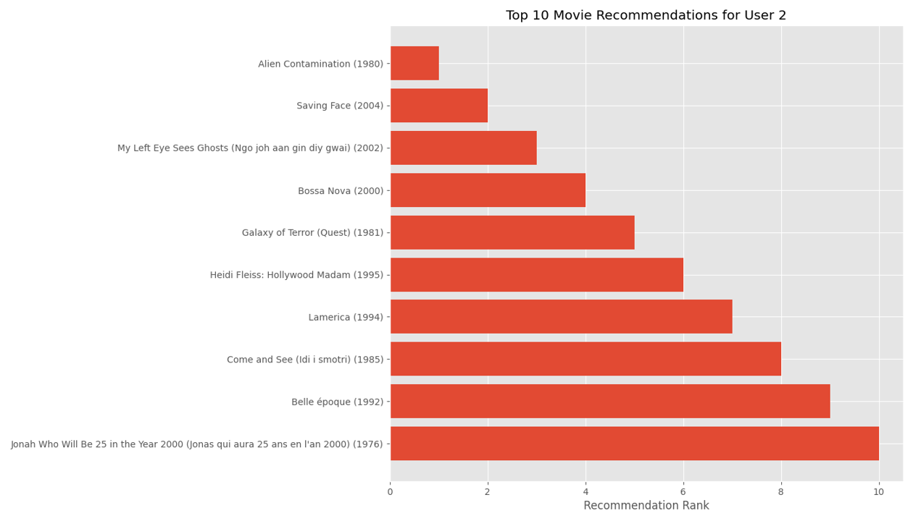
Figure 10: Movie recommendations for User 2

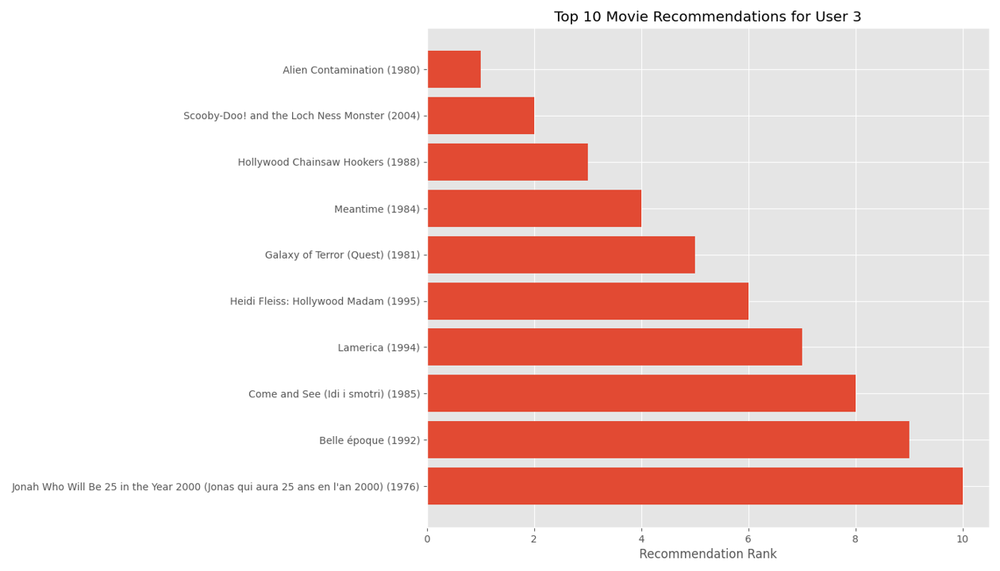
Figure 11: Movie recommendations for User 3

